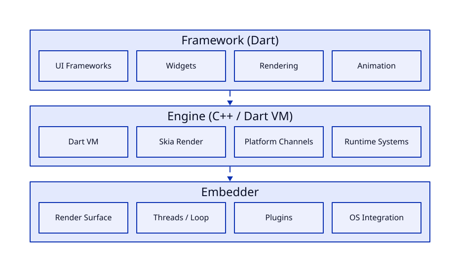
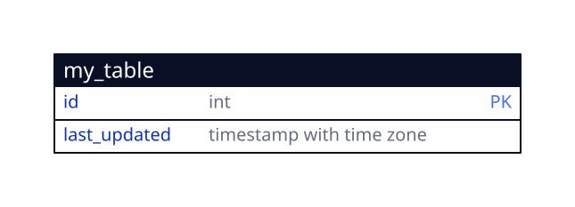

+++
title = "Pwning Flutter Apps"
date = 2026-03-08
draft = true

[taxonomies]
tags = ["technical","android"]

+++

Flutter apps are quite different from the usual Android apps, and pentesting them often requires a different approach.

Here’s how I would go about when pentesting a Flutter application.

Outline:
About flutter,dart
Where to look
Active testing (easiet)
Passive test (harder)

## Background on Flutter

Flutter is used to write cross platform apps in the Dart language.

---

## Credits

*Banner image: Photo by [Marek Piwnicki](https://unsplash.com/photos/snowy-mountain-peak-under-streaking-stars-pE9RxXqGbd4) on Unsplash*
