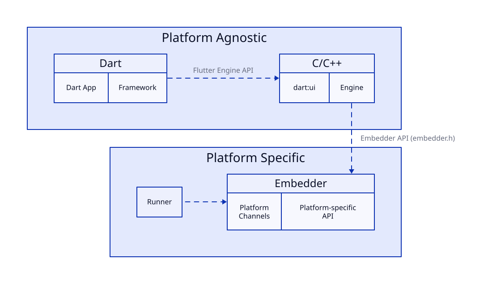
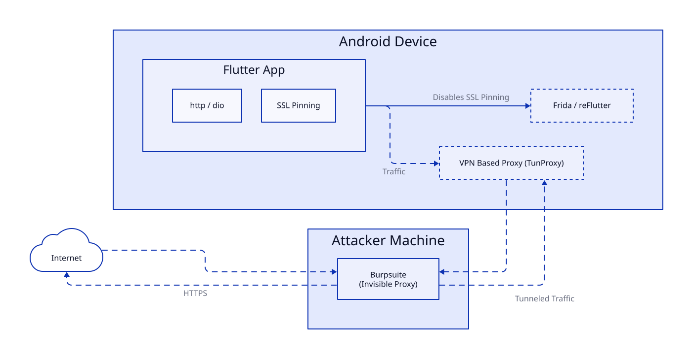

+++
title = "Pwning Flutter Apps"
date = 2026-03-08
draft = true

[taxonomies]
tags = ["technical","android"]

+++

Flutter apps are quite different from the usual Android apps, and pentesting them often requires a different approach.

Here’s how I would go about when pentesting a Flutter application.

Outline:
About flutter,dart
Where to look
Active testing (easiet)
Passive test (harder)

## Background on Flutter

Flutter is an open-source SDK used to write cross platform apps in the Dart language. Flutter itself is built on C,C++,Dart and Skia

Instead of using native UI components, Flutter draws every pixel on the screen using its own rendering engine.This also means Flutter has its own HTTP client which I will get onto later

The architecture of a typical Flutter app looks like this


The dart code of the app is compiled ahead-of-time as a `AOT snapshot` which is then ran by the stripped down Dart VM called `precompiled runtime` inside the Engine

The `AOT snapshot` just contains machine code which you can run through Ghidra, although I would not recommend it as it is quite hard to reverse engineer Dart code from machine code.

The AOT snapshot contains:
- *Dart VM Snapshot* - Shared VM heap state (objects/strings)
- *Dart VM Instructions* - Shared VM stubs
- *Isolate Snapshot* - Per-isolate heap state
- *Isolate Instructions* - Main AOT compiled Dart code

> P.S The AOT snapshot has both the Dart code and Flutter's framework code

The files you should be looking at are 
```bash
libapp.so     # AOT Snapshot
libflutter.so # Flutter Engine
```

Going forward it would be best to not use a bundled APK(.XAPK .APKM) as they are a pain to patch and modify. If the app you are trying to pentest has a bundled APK, you can use [
AntiSplit-M](https://github.com/AbdurazaaqMohammed/AntiSplit-M) to get a single merged APK

## Dynamic Analysis

This would be easiest method and the one I would recommend you first go for.

### Intercepting HTTP traffic



Most flutter apps use the `http` or `dio` package to make HTTP requests which means they implement SSL pinning and do not respect system proxy settings

There are two primary ways to bypass SSL pinning:

1. **Using Frida** with the [disable-flutter-tls-verification](https://github.com/NVISOsecurity/disable-flutter-tls-verification) script.
    - The included patterns only work for `x86` and `x64` builds.
2. **Patching the application** using [reFlutter](https://github.com/Impact-I/reFlutter).
    - This should work across all architectures and can also print function offsets.

Once you have bypassed SSL pinning, you can proxy the traffic using one of the following methods:

1. **Android Emulator:** Launch the emulator with the `-http-proxy http://<proxy_host>:<proxy_port>` flag, or configure it directly in the emulator settings.
2. **Physical Device:** Use [TunProxy](https://github.com/raise-isayan/TunProxy) or any other VPN-based proxy app.

> Invisible proxying is necessary, Flutter just ignores the system proxy settings

If you are using BurpSuite, you can enable `Support invisible proxying`

{{ resize_image(path="content/blog/pwing-flutter-apps/images/burp.png", width=700, height=500, op="fit") }}
---


## Credits

*[](https://swarm.ptsecurity.com/fork-bomb-for-flutter/)
*[](https://github.com/flutter/flutter)
*[](https://blog.nviso.eu/2022/08/18/intercept-flutter-traffic-on-ios-and-android-http-https-dio-pinning/)
*Banner image: Photo by [Marek Piwnicki](https://unsplash.com/photos/snowy-mountain-peak-under-streaking-stars-pE9RxXqGbd4) on Unsplash*
